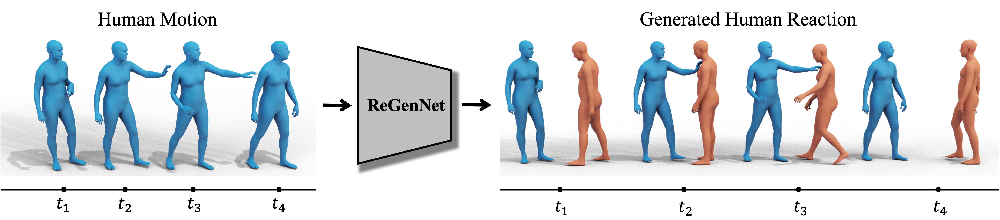
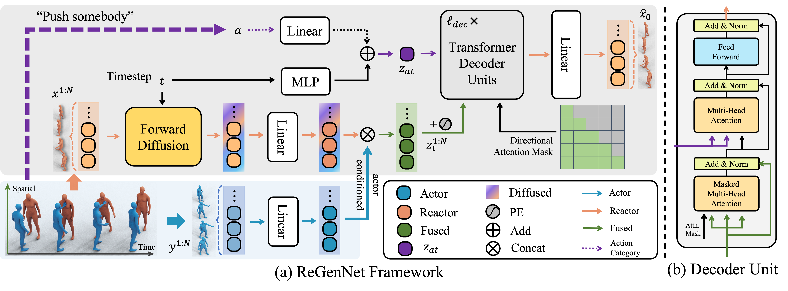

# ReGenNet: Towards Human Action-Reaction Synthesis



<p align="left">
  <a href='https://arxiv.org/abs/2403.11882'>
    
  </a>
  <a href='https://arxiv.org/pdf/2403.11882.pdf'>
    
  </a>
  <a href='https://liangxuy.github.io/ReGenNet/'>
  </a>
  <a href="" target='_blank'>
    
  </a>
</p>

This repository contains the content of the following paper:
> ReGenNet: Towards Human Action-Reaction Synthesis <br>[Liang Xu](https://liangxuy.github.io/)<sup>1,2</sup>, [Yizhou Zhou](https://scholar.google.com/citations?user=dHBNmSkAAAAJ&hl=zh-CN)<sup>3</sup>, [Yichao Yan](https://daodaofr.github.io/)<sup>1</sup>,  [Xin Jin](http://home.ustc.edu.cn/~jinxustc/)<sup>2</sup>, Wenhan Zhu, [Fengyun Rao](https://scholar.google.com/citations?user=38dACd4AAAAJ&hl=en)<sup>3</sup>, [Xiaokang Yang](https://scholar.google.com/citations?user=yDEavdMAAAAJ&hl=zh-CN)<sup>1</sup>, [Wenjun Zeng](https://scholar.google.com/citations?user=_cUfvYQAAAAJ&hl=en)<sup>2</sup><br>
> <sup>1</sup> Shanghai Jiao Tong University <sup>2</sup> Eastern Institute of Technology, Ningbo <sup>3</sup>WeChat, Tencent Inc.


## News
- [2024.07.14] We release the training, evaluating codes, and the trained models.
- [2024.03.18] We release the paper and project page of ReGenNet.


## Framework



## Installation
1. First, please clone the repository by the following command:
    ```
    git clone https://github.com/liangxuy/ReGenNet.git
    cd ReGenNet
    ```

2. Setup the environment
    <details>
      <summary>1. Setup the conda environment with the following commands:</summary>

      * Install ffmpeg (if not already installed)
        ```
        sudo apt update
        sudo apt install ffmpeg
        ```
      * Setup conda environment
        ```
        conda env create -f environment.yml
        conda activate regennet
        python -m spacy download en_core_web_sm
        pip install git+https://github.com/openai/CLIP.git
        ```
      * Install mpi4py (multiple GPUs)
        ```
        sudo apt-get install libopenmpi-dev openmpi-bin
        pip install mpi4py
        ```
    </details>

    We also provide a Dockerfile (docker/Dockerfile) if you want to build your own docker environment.

3. Download other required files

    * You can download the pretrained models at [Google drive](https://drive.google.com/drive/folders/1UtIIB67cZyWAfaw1ZKYjerp_pEAk_XTc?usp=sharing) and move them to `save` folder to reproduce the results.

    * You need to download the action recognition models at [Google drive](https://drive.google.com/drive/folders/1oi1LCNMz3bQoiOktUEeyZRVb6VXEFohP?usp=sharing) and move them to `recognition_training` for evaluation.

    * Download the SMPL neutral models from the [SMPL website](https://smpl.is.tue.mpg.de/) and the SMPL-X models from the [SMPL-X website](https://smpl-x.is.tue.mpg.de/) and then move them to `body_models/smpl` and `body_models/smplx`. We also provide a copy [here](https://drive.google.com/drive/folders/1OSLli1j7EBk79tvWk0Ep_adbCM20k8ZV?usp=sharing) for the convenience.

## Data Preparation

### NTU RGB+D 120
Since the license of NTU RGB+D 120 dataset does not allow us to distribute its data and annotations, we cannot release the processed NTU RGB+D 120 dataset publicly. If someone is interested at the processed data, please email me.

### Chi3D

You can download the original dataset [here](https://ci3d.imar.ro/download) and the actor-reactor order annotations [here](https://drive.google.com/file/d/1OvdOGgH1JpVL7viTgPOKHzJSVRB3NczN/view?usp=sharing).

You can also download the processed dataset at [Google Drive](https://drive.google.com/drive/folders/1wPStrZgZaOa42ilADZRvv-_U7gBNjQEr?usp=sharing) and put them under the folder of `dataset/chi3d`.

### InterHuman

You can download the original dataset [here](https://tr3e.github.io/intergen-page/) and the actor-reactor order annotations [here](https://drive.google.com/file/d/10nLfK4uYNblHUhFXKHZWIbFvnRr7G805/view?usp=sharing) and put them under the folder of `dataset/interhuman`.


## Training
We provide the script to train the model of the `online` and `unconstrained` setting for human action-reaction synthesis on the `NTU120-AS` dataset. `--arch`, `--unconstrained` and `--dataset` can be customized for different settings.

* Training with 1 GPU:

  ```
  # NTU RGB+D 120 Dataset
  python -m train.train_mdm --setting cmdm --save_dir save/cmdm/ntu_smplx --dataset ntu --cond_mask_prob 0 --num_person 2 --layers 8 --num_frames 60 --arch online --overwrite --pose_rep rot6d --body_model smplx --data_path PATH/TO/xsub.train.h5 --train_platform_type TensorboardPlatform --vel_threshold 0.03 --unconstrained
  ```

  ```
  # Chi3D dataset
  python -m train.train_mdm --setting cmdm --save_dir save/cmdm/chi3d_smplx --dataset chi3d --cond_mask_prob 0 --num_person 2 --layers 8 --num_frames 150 --arch online --overwrite --pose_rep rot6d --body_model smplx --data_path PATH/TO/chi3d_smplx_train.h5 --train_platform_type TensorboardPlatform --vel_threshold 0.01 --unconstrained
  ```

* Training with multiple GPUs (4 GPUs in the example):

  ```
  mpiexec -n 4 --allow-run-as-root python -m train.train_mdm --setting cmdm --save_dir save/cmdm/ntu_smplx --dataset ntu --cond_mask_prob 0 --num_person 2 --layers 8 --num_frames 60 --arch online --overwrite --pose_rep rot6d --body_model smplx --data_path PATH/TO/xsub.train.h5 --train_platform_type TensorboardPlatform --vel_threshold 0.03 --unconstrained
  ```


## Evaluation

For the action recognition model, you can 

1. Directly download the trained action recognition model [here](https://drive.google.com/drive/folders/1oi1LCNMz3bQoiOktUEeyZRVb6VXEFohP?usp=sharing);

2. Or you can train your action recognition model:

    The code of training the action recognition model is based on the [ACTOR](https://github.com/Mathux/ACTOR) repository.
    <details>
      <summary>Commands for training your own action recognition model:</summary>

      ```python
      cd actor-x;
      # Before training, you need to set up the `dataset` and folder of the `SMPL-X models`
      ### NTU RGB+D 120 ###
      python -m src.train.train_stgcn --dataset ntu120_2p_smplx --pose_rep rot6d --num_epochs 100 --snapshot 10 --batch_size 64 --lr 0.0001 --num_frames 60 --sampling conseq --sampling_step 1 --glob --translation --folder recognition_training/ntu_smplx --datapath dataset/ntu120/smplx/conditioned/xsub.train.h5 --num_person 2 --body_model smplx

      ### Chi3D ###
      python -m src.train.train_stgcn --dataset chi3d --pose_rep rot6d --num_epochs 100 --snapshot 10 --batch_size 64 --lr 0.0001 --num_frames 150 --sampling conseq --sampling_step 1 --glob --translation --folder recognition_training/chi3d_smplx --datapath dataset/chi3d/smplx/conditioned/chi3d_smplx_train.h5 --num_person 2 --body_model smplx
      ```
    </details>

The following script will evaluate the trained model of `PATH/TO/model_XXXX.pt`, the `rec_model_path` is the action recognition model. The results will be written to `PATH/TO/evaluation_results_XXXX_full.yaml`. We use `ddim5` to accelerate the evaluation process.

```
python -m eval.eval_cmdm --model PATH/TO/model_XXXX.pt --eval_mode full --rec_model_path PATH/TO/checkpoint_0100.pth.tar --use_ddim --timestep_respacing ddim5
```

If you want to get a table with mean and interval, you can use this script:

```
python -m eval.easy_table PATH/TO/evaluation_results_XXXX_full.yaml
```

## Motion Synthesis and Visualize

1. Generate the results, and the results will be saved to `results.npy`.

    ```
    python -m sample.cgenerate --model_path PATH/TO/model_XXXX.pt --action_file assets/action_names_XXX.txt --num_repetitions 10 --dataset ntu --body_model smplx --num_person 2 --pose_rep rot6d --data_path PATH/TO/xsub.test.h5 --output_dir XXX
    ```

2. Render the results

    Install additional dependencies
    ```
    pip install trimesh
    pip install pyrender
    pip install imageio-ffmpeg
    ```

    ```
    python -m render.crendermotion --data_path PATH/TO/results.npy --num_person 2 --setting cmdm --body_model smplx
    ```

## TODO
- [x] Release the training, evaluating codes, and the trained models.
- [x] Release the annotation results.


## Acknowledgments

We want to thank the following contributors that our code is based on:

[ACTOR](https://github.com/Mathux/ACTOR), [motion diffusion model](https://github.com/GuyTevet/motion-diffusion-model), [guided diffusion](https://github.com/openai/guided-diffusion), [text-to-motion](https://github.com/EricGuo5513/text-to-motion), [HumanML3D](https://github.com/EricGuo5513/HumanML3D)


## License
This code is distributed under an [MIT LICENSE](https://github.com/liangxuy/ReGenNet/blob/main/LICENSE).

Note that our code depends on other libraries, including CLIP, SMPL, SMPL-X, PyTorch3D, and uses datasets that each have their own respective licenses that must also be followed.


## Citation
If you find ReGenNet is useful for your research, please cite us:

```
@inproceedings{xu2024regennet,
  title={ReGenNet: Towards Human Action-Reaction Synthesis},
  author={Xu, Liang and Zhou, Yizhou and Yan, Yichao and Jin, Xin and Zhu, Wenhan and Rao, Fengyun and Yang, Xiaokang and Zeng, Wenjun},
  booktitle={CVPR},
  pages={1759--1769},
  year={2024}
}
```